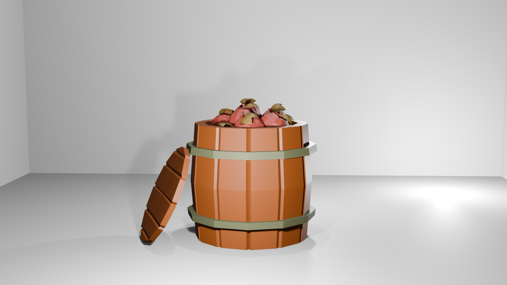
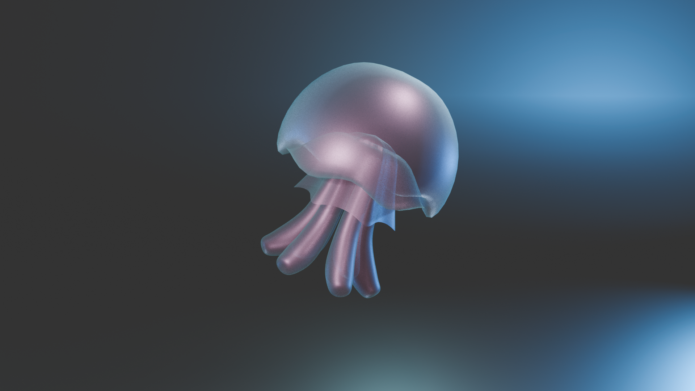
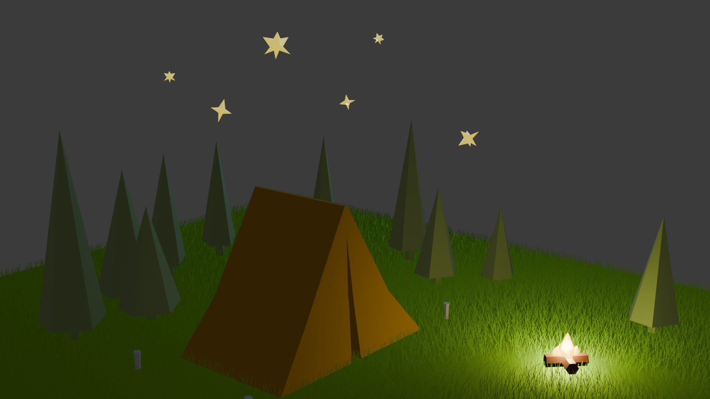

<html>
  <body>
    <address> <b> Website </b>: stacyhyang.github.io </address>
     
    <address> <b> Phone Number </b>: (310)600-1419 </address>
     
    <address> <b> Email </b>: stacyhyang@gmail.com </address>
      
    <address> <b> LinkedIn </b>: www.linkedin.com/in/stacyhyang </address>
    

    <h3 class="centered-heading">About Me</h3>
    
 I'm a Cognitive Behavioral Neuroscience and Cinematic Arts double major at UCSD. I'm eager to explore the development of the human mind and its impact on learning and the formation of new language. I'm interested in creating cinema through the use of various elements that evoke emotion, explore themes, and inspire positive change.

    

    <h3 class="centered-heading">Projects</h3>
    <h4> Film Projects </h4>
    <video width="320" height="240" controls>
      <source src="Downloads/STACY_Exoriation.mp4" type="video/mp4">
    </video>
    <h4> Blender Projects </h4>
    
    
    
    
    
  </body>
</html>
